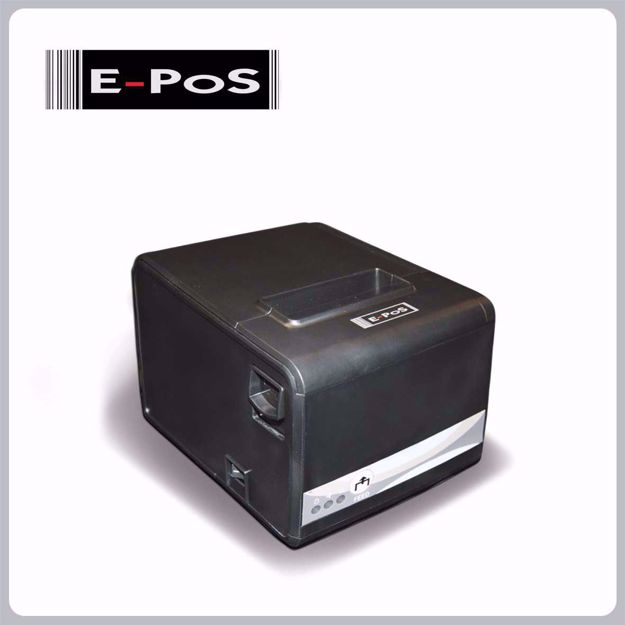

# Queue Printer - Queue Management System

## Introduction

The **Queue Printer** is a dedicated printing service for the **Queue Management System**. It ensures seamless ticket printing by acting as a server that listens to print requests and sends them to the **E-POS ECO-250 printer**. This system helps in managing customer flow efficiently by providing printed queue tickets on demand.

<div style="text-align: center;">
    
</div>

This service runs on **Windows Printing API** and has been tested on **Windows 11 (24H2 version)**.

## Supported Printer

- **Model:** E-POS ECO-250
- **Driver & Tools:** EPOS ECO-250 Driver & Tools (2024)
- **Download Link:** [EPOS ECO-250 Driver & Tools](https://www.oscaret.com/e-pos-eco-250)

## Features

- Listens for print requests from the Queue Management System.
- Processes and prints ticket data.
- Uses **Windows Print Server** for handling print jobs.
- Supports **bold text** and **adjustable font sizes** for ticket printing.

## Installation & Setup

### 1. Install Dependencies

Ensure you have **Python** installed, then run:

```bash
pip install -r requirements.txt
```

### 2. Install Printer Driver

Download and install the **E-POS ECO-250 Driver & Tools** from the [official link](https://www.oscaret.com/e-pos-eco-250).

or u can get it from the repo, `util/E-PoS Printer Driver 2024.rar`.

### 3. Run the Server

Start the printer service using:

```bash
python server.py
```

The server will start listening for print requests from the queue management system.

## System Requirements

- **Operating System:** Windows 11 (24H2 version tested)
- **Printer:** E-POS ECO-250
- **Printer Driver:** Must be installed before running the server.

## How It Works

1. The Queue Management System sends a print request.
2. The server receives and processes the request.
3. The **E-POS ECO-250 printer** prints the queue ticket.

## Future Improvements

- Support for more printer models.
- Enhanced error handling and logging.
- Cross-platform support.

## License

This project is **handmade** and created by me. You are free to modify and enhance it as needed. If you make changes, please push them in a **feature branch** for better version control.

---

For any issues or contributions, feel free to reach out. 

use test_Printer.py

